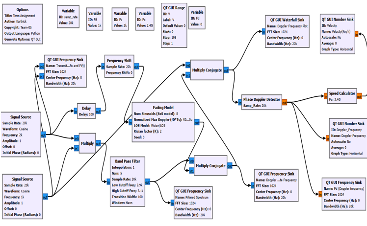
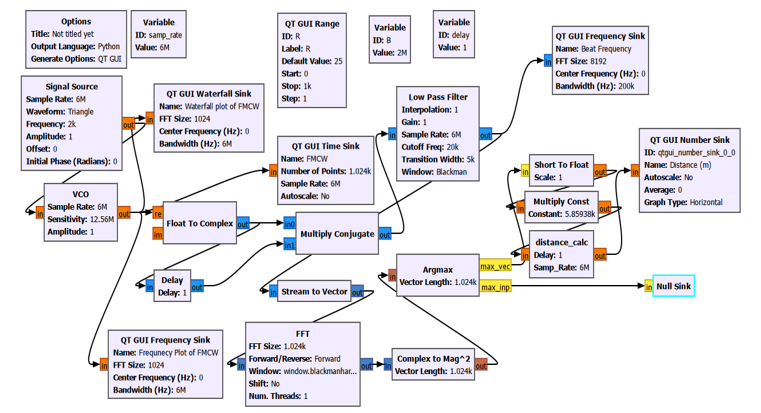
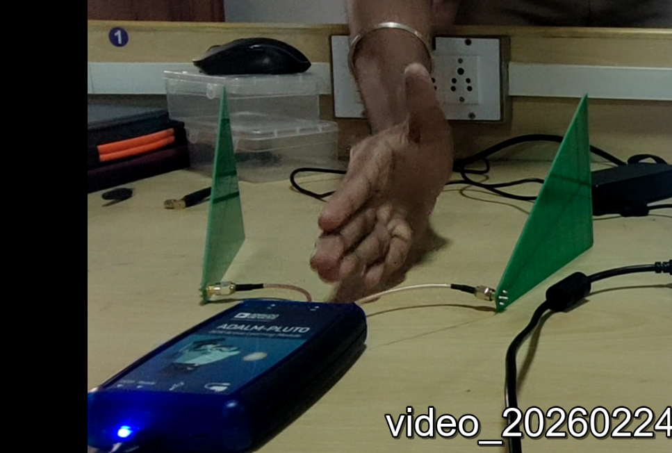

# SDR-Based Real-Time Radar for Velocity and Distance Measurement

A Software Defined Radio (SDR) based radar system for real-time target velocity and distance estimation using Continuous Wave (CW) Doppler radar and Frequency Modulated Continuous Wave (FMCW) radar techniques.

## Overview

This project implements a radar processing system using an **ADALM-Pluto SDR** and GNU Radio.

The system explores two radar techniques:

- **CW Doppler radar** for velocity estimation
- **FMCW radar** for distance estimation

For velocity measurement, a phase-based Doppler estimation method is implemented. The instantaneous phase of the received complex baseband signal is extracted and unwrapped, and the phase variation is used to estimate Doppler frequency and target velocity.

The physical velocity experiment was performed using one ADALM-Pluto SDR connected to two log-periodic antennas, with one antenna used for transmission and the other for reception. A moving target was manually moved toward and away from the radar setup.

## Hardware Setup

### Hardware

- ADALM-Pluto SDR
- 2 × Log-periodic antennas
- Computer running GNU Radio
- Moving target

### Experimental Configuration

The ADALM-Pluto SDR was connected to two log-periodic antennas:

- Antenna 1 → Transmitter
- Antenna 2 → Receiver

The target was moved toward and away from the radar setup, producing a Doppler frequency shift in the received signal.

## Methodology

### 1. Velocity Estimation

The velocity of a moving target is related to the Doppler frequency by:

$$
v = \frac{f_d c}{2f_c}
$$

where:

- $v$ = target velocity
- $f_d$ = Doppler frequency
- $c$ = speed of light
- $f_c$ = carrier frequency

Instead of relying directly on FFT or Welch spectral estimation, the implementation estimates Doppler frequency from the rate of change of the instantaneous phase of the received signal.

The processing pipeline is:

**Received RF Signal**

↓

**Complex Baseband Signal**

↓

**Phase Extraction**

↓

**Phase Unwrapping**

↓

**Phase Difference**

↓

**Doppler Frequency**

↓

**Target Velocity**

### 2. Distance Estimation

The project also implements an FMCW radar processing chain for distance estimation.

The FMCW processing pipeline is:

**Chirp Generation**

↓

**RF Transmission**

↓

**Delayed Received Signal**

↓

**Mixing**

↓

**Beat Frequency**

↓

**Distance Estimation**

## GNU Radio Implementation

### Velocity Estimation Flowgraph



The velocity-processing chain performs signal generation,
frequency shifting, conjugate multiplication, phase-based Doppler
detection, and velocity calculation.

### Distance Estimation Flowgraph



The FMCW processing chain generates the chirp, mixes the transmitted
and received signals, applies filtering and FFT processing, and
extracts the beat frequency for distance estimation.
## My Contribution

I worked mainly on the radar signal-processing implementation and GNU Radio flowgraphs.

My contributions included:

- Designing and implementing the GNU Radio flowgraph for velocity estimation.
- Implementing the phase-based Doppler processing used to estimate target velocity.
- Developing the FMCW processing flowgraph for distance estimation.
- Working on the signal-processing stages required for Doppler and beat-frequency analysis.
- Integrating and testing the radar processing chain with the ADALM-Pluto SDR hardware.
- Participating in the experimental validation using a physical target.

## Software

- GNU Radio
- Python
- NumPy
- SciPy
- Matplotlib

## Hardware Setup

The physical radar setup uses a single **ADALM-Pluto SDR** connected to two log-periodic antennas.

### Configuration

| Component | Configuration |
|---|---|
| SDR | ADALM-Pluto |
| Number of SDRs | 1 |
| TX Antenna | Log-periodic antenna |
| RX Antenna | Log-periodic antenna |
| Processing Platform | GNU Radio + Python |
| Target | Moving object |

The two antennas are connected to the same ADALM-Pluto SDR, with one antenna used for transmission and the other for reception.

During the velocity experiment, the target was manually moved toward and away from the antenna setup. The reflected signal was received by the RX antenna and processed to estimate the Doppler frequency and corresponding target velocity.



## Results

The velocity measurement experiment demonstrates real-time Doppler-based velocity estimation using the physical ADALM-Pluto SDR setup.

The project also evaluates the radar processing chain under different channel conditions and demonstrates the relationship between Doppler frequency and target velocity.

## Key Features
- Real-time SDR-based radar processing
- ADALM-Pluto hardware implementation
- CW Doppler velocity estimation
- Phase-based Doppler frequency estimation
- FMCW distance estimation
- GNU Radio flowgraph implementation
- Python-based signal processing

## Future Improvements
- Improve velocity estimation under multipath conditions
- Perform systematic measurements at different target velocities
- Integrate velocity and distance measurements into a unified hardware-tested flowgraph
- Improve real-time visualization
- Evaluate the system with different antenna configurations and target types

## Repository Structure

```text
SDR-Radar-Velocity-Distance/
│
├── src/
│   ├── Doppler.py
│   ├── Doppler_epy_block_0.py
│   ├── Doppler_epy_block_1.py
│   ├── options_0.py
│   └── options_0_epy_block_0_1.py
│
├── flowgraphs/
│   ├── R1_Velocity_Determination.grc
│   └── R2_Distance_Measurement.grc
│
├── results/
│   └── hardware_setup.jpg
│
├── docs/
│
├── requirements.txt
├── .gitignore
└── README.md

